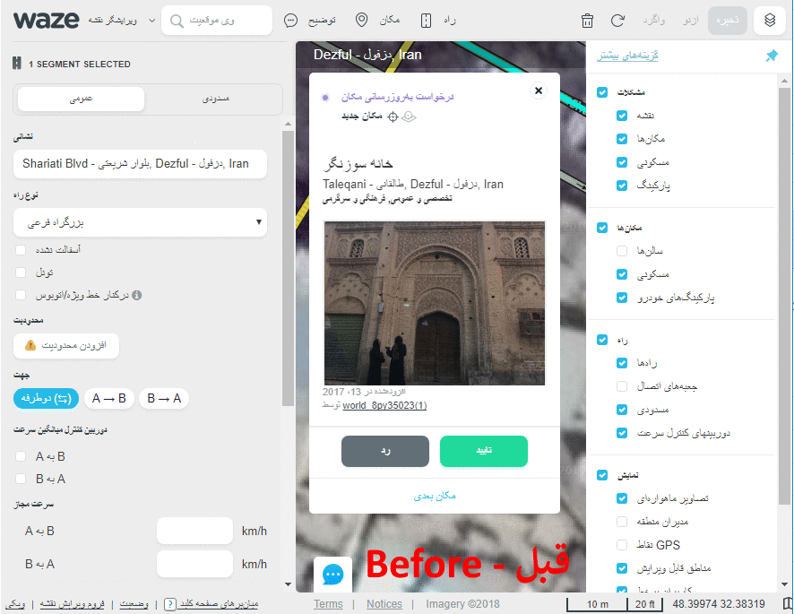

# PUF (Persian UI Fix) #
**Contributors:** [Ali Abulhallaj](http://google.com/+AliAbulhallaj)  
**Tags:** puf, persian ui fix, wme, wme script  
**Requires :** [TamperMonkey](https://tampermonkey.net/)  
**License:** GPLv3  
**License URI:** http://www.gnu.org/licenses/gpl-3.0.html  
**Changelog:** [Read here](changelog.md)

Add some alternation to fix editor UI for Persian editors  

## توضیحات ##

این اسکریپت به منظور بهینه‌سازی رابط کاربری برای کاربران فارسی زبان طراحی شده است. سعی بر این است تا محیط ادیتور تا حد ممکن با ساختار راست به چپ هماهنگ شده و تجربه شما را بهبود بخشد.

مواردی که این اسکریپت مرتفع میکند:

- اصلاح فونت فارسی در محیط ویرایشگر برای خوانایی بیشتر
- راست‌چین کردن منوی تنظیمات ویرایشگر
- راست‌چین کردن برگه خوراک و سایر زیرمنوها
- راست‌چین کردن برگه سفرها
- راست‌چین کردن برگه منطقه‌ها
- راست‌چین کردن برگه مشخصات سگمنت
- راست‌چین کردن برگه مشخصات مکان
- راست‌چین کردن پنجره تغییرات هنگام ذخیره
- راست‌چین کردن منوهای رسم سگمنت و محل
- راست‌چین کردن پنجره کامنت‌ها
- راست‌چین کردن پنجره دوربین‌ها
- راست‌چین کردن پنجره اعلانات
- راست‌چین کردن قسمت تاریخچه سگمنت
- راست‌چین کردن قسمت محدودیت‌های سگمنت
- راست‌چین کردن دیگر قسمت‌ها جهت همخوانی با عبارات فارسی
- اصلاح برخی فواصل متون جهت نمایش بهتر
- اصلاح مکان برخی آیکون‌ها

## نصب و راه‌اندازی ##
این اسکریپت جهت کار به [TamperMonkey](https://tampermonkey.net/) احتیاج دارد. که با کلیک بر روی لینک [TamperMonkey](https://tampermonkey.net/) می‌توانید نسبت به نصب آن اقدام کنید.

سپس جهت دریافت اسکریپت به آدرس 
https://greasyfork.org/en/scripts/36146-wme-persian-ui-fix
مراجعه نموده و بر روی Install کلیک کرده و دوباره در صفحه جدید روی Install کلیک کنید

در صفحه تنظیمات ویرایشگر کافیست زبان را روی پارسی تنظیم کنید
